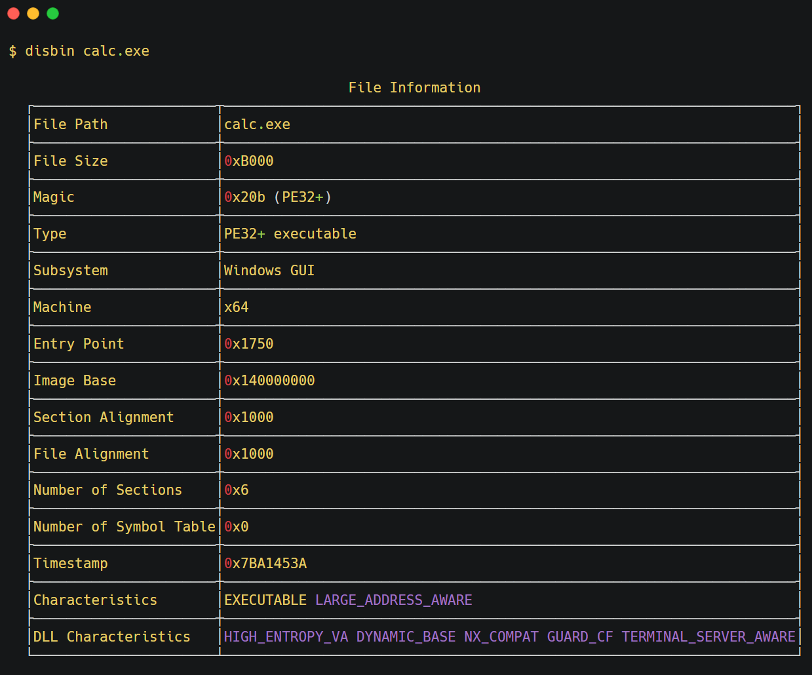

# Disbin



Disbin analyzes **Elf/PE** files and displays detailed information. I hope it is useful for reverse engineering. 

## Features

- Basic file information
- File hashes
- PE Headers analysis: DOS Header, Rich Header, COFF Header, Optional Header, Sections and others.
- Elf headers analysis: Program Headers, Section Headers, Dynamic Section, Symbol Table, and others.
- Hex dump
- Disassemble

Thanks to the amazing crates: `goblin`, `termimad`, `capstone`

## Install

Download from [releases](https://github.com/hideckies/disbin/releases/) page and extract it.

## Usage

```sh
# Display file information, hashes, etc.
disbin example.exe

# Display file information only
disbin -i example.exe

# Display file hashes only
disbin --hash example.exe

# Display all headers
disbin -a example.exe

# Display sections
disbin -s example.exe

# Hex dump
disbin -x example.exe
# Hex dump with specified range
disbin -x example.exe --start 0x30 --end 0xA0

# Disassemble
disbin -d example.exe
# Disassemble .text section only
disbin -d /usr/bin/ls --start .text --end .text
```

For other options, run `disbin --help` command.

## Build from Source

```sh
git clone https://github.com/hideckies/disbin.git
cd disbin
cargo build --release
./target/release/disbin --help
```
